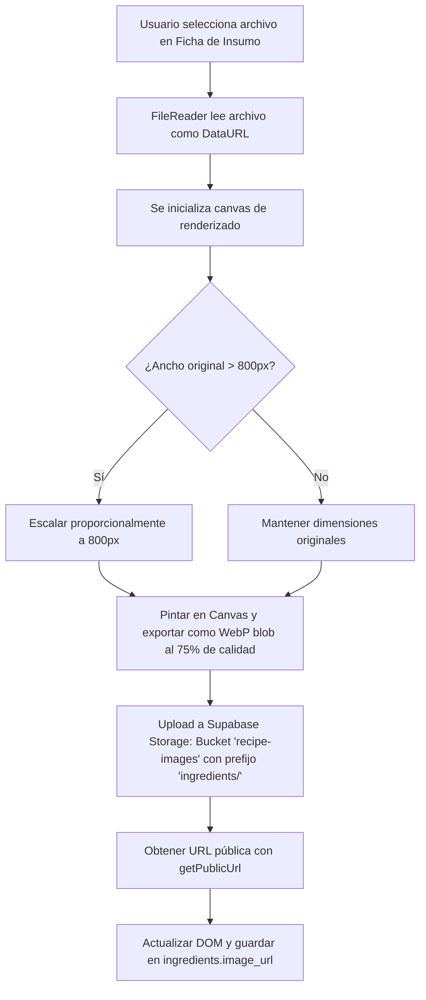

# Especificación Técnica: Carga y Visualización de Imágenes de Insumos (Ingredientes)
**ACFC Kitchen — Módulo de Inventario**

Este documento detalla el diseño técnico, la estructura de base de datos y la implementación del flujo de carga y optimización de imágenes para los insumos en el panel de control.

---

## 1. Estructura de Datos (Base de Datos Supabase)

Las URLs públicas de las imágenes de los ingredientes se guardan en la columna `image_url` de la tabla `public.ingredients`.

* **Tabla**: `public.ingredients`
* **Columna**: `image_url`
* **Tipo**: `VARCHAR(1000)` (admite cadenas nulas si no se ha subido ninguna foto)
* **Comentario de base de datos**: `'URL pública de la foto del insumo'`

---

## 2. Flujo de Carga y Optimización en Cliente (Frontend)

Para prevenir la saturación de espacio de almacenamiento, el navegador realiza una compresión y conversión automática antes de enviar el archivo binario:

### Reglas de Optimización:
* **Formato final**: `image/webp`
* **Calidad de compresión**: `0.75` (75%)
* **Ancho máximo (Max Width)**: `800px` (el alto se escala proporcionalmente)
* **Destino de Storage**: Bucket público `recipe-images`, bajo la subcarpeta lógica `ingredients/`.

---

## 3. Modificaciones e Integración del Código

### A. Interfaz del Formulario (Ficha del Insumo)
Se modificó [frontend/index.html](file:///Users/jordicandelareal/Jordi/Antigravity/ACFC%20Kitchen/frontend/index.html) para agregar un selector de archivos estilizado con Tailwind CSS justo al lado del selector de escenario de salida:
* Elemento de carga: `<input type="file" id="ing-file-input">`
* Estado de previsualización: Imagen en miniatura (`#ing-image-preview`) y spinner de progreso (`#ing-upload-spinner`).
* El selector de archivos soporta la cámara nativa si se accede mediante dispositivos móviles/PWA (`accept="image/*"`).

### B. Tabla de Matriz de Stock (Thumbnail en la Lista)
En la lista general de ingredientes (`renderInventory`), se añadió la visualización de la miniatura a la izquierda del nombre del ingrediente:
* Se valida la existencia de la URL mediante un operador ternario/optional chaining de Javascript.
* Si el campo `image_url` es nulo, se muestra un icono de fallback de marcador de posición (`image`).
* Si el origen de la imagen falla al cargar, un manejador de error `onerror` reasigna dinámicamente un avatar de marcador de posición de iniciales usando el servicio `placehold.co`.

### C. Persistencia y Transacciones Supabase
* Al hacer click en "Guardar cambios", la función `saveIngredient()` extrae el valor del input `#ing-image-input` y lo añade al payload de mutación (`image_url`).
* La función `loadSupabaseInventory()` mapea el campo `image_url` de la respuesta de base de datos directamente al estado local React/Vanilla `INVENTORY` para evitar discrepancias e hidrataciones tardías.
